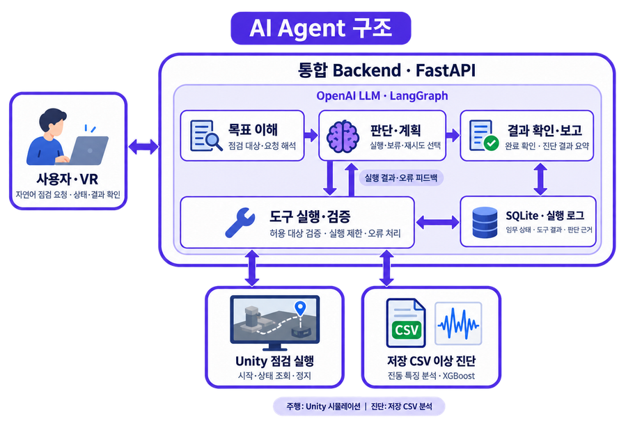
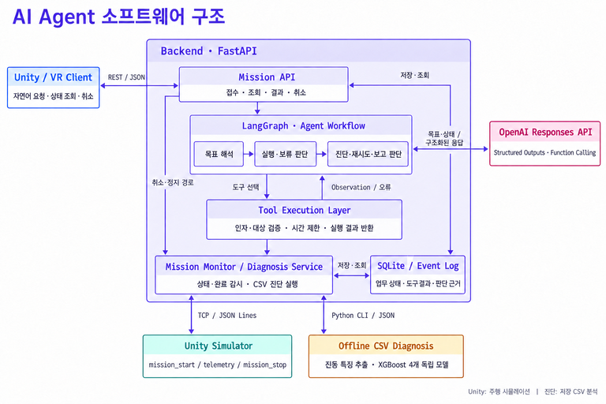
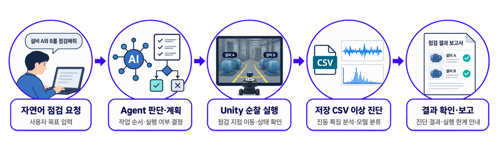
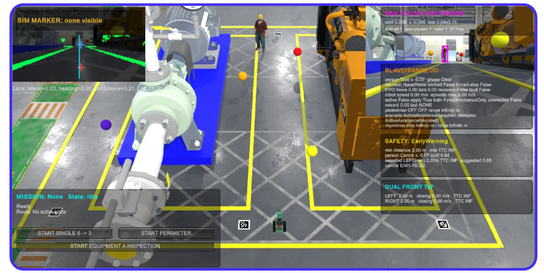
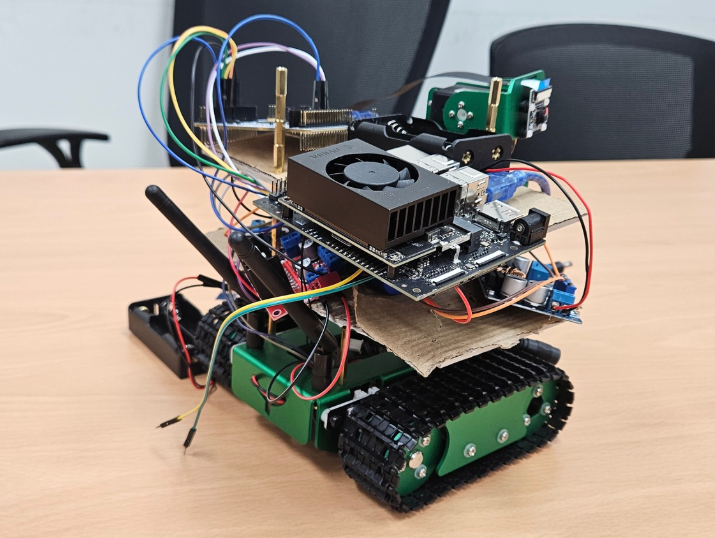
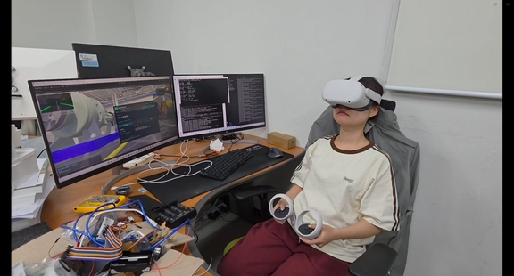
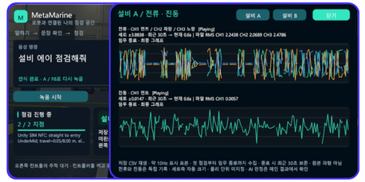

# auto-marine-inspect-bot-vr

## MetaMarine — 메타마린

**제조현장·선박 회전 설비 점검을 위한 VR 연계 Physical AI Agent**

반복적인 설비 순찰과 위험구역 접근 부담을 줄이기 위해, 자연어 점검 요청부터 Unity 주행·진단·결과 보고까지 연결하는 프로젝트입니다. 사용자는 VR에서 로봇 시점으로 현장을 확인하고 음성으로 점검을 요청하며, 진행 상황과 진단 결과를 대시보드에서 확인합니다.

### 주요 기능

- **자연어 점검 요청:** 설비 A, B 또는 A+B를 선택하여 점검합니다.
- **AI Agent:** 목표를 해석하고 실행·보류, 진단 재시도, 결과 보고를 판단합니다. 저수준 주행 제어는 Unity가 담당합니다.
- **Unity·로봇 연계:** 지정 경로를 순찰하고 지점별 점검을 수행하며, Unity 주행 명령을 JetBot으로 전달하는 통신 구조를 제공합니다.
- **설비 이상 진단:** 저장 진동 CSV를 축 정렬·베어링·벨트·회전체의 XGBoost 독립 모델 4개로 분석합니다. 모델별 이상 확률과 판정을 제공하며, 분석 실패는 미판정으로 구분합니다.
- **VR 대시보드·이력:** 설비별 정상·비정상 결과와 그래프를 표시하고, 임무 상태·진단 결과·실행 근거를 SQLite와 로그에 기록합니다. 사용자 취소는 LLM 응답을 기다리지 않고 처리합니다.

### 시스템 구성

### AI Agent 구조

AI Agent는 점검 목표와 실행 결과를 바탕으로 다음 작업을 선택합니다. Backend는 도구의 인자와 실행 조건을 검증하고, Unity는 실제 주행 제어를 담당합니다.

| 구성 요소 | 역할 |
| --- | --- |
| Mission API · FastAPI | 자연어 요청 접수, 임무 생성, 상태·결과 조회와 취소 |
| OpenAI Responses API · LangGraph | 점검 대상을 구조화하고 실행·보류, 진단 재시도, 보고를 판단 |
| Tool Execution Layer | 허용된 도구와 대상·인자를 검증하고 실행 결과·오류를 Agent에 전달 |
| Mission Monitor · Diagnosis Service | Unity 상태와 지점별 점검 완료를 감시하고 저장 CSV 진단을 실행 |
| SQLite · Event Log | 임무 상태, 도구 실행·진단 결과와 판단 근거를 저장 |

진단 실패 시 같은 CSV를 최대 1회 재분석하거나 미판정으로 처리합니다. 최종 완료는 Unity 임무 종료와 선택 설비의 모든 점검 지점 진단 성공을 확인한 뒤 결정하며, 사용자 취소·정지는 LLM 응답과 독립적으로 처리합니다.

### 동작 흐름

**음성·텍스트 요청 → Backend / AI Agent → Unity 순찰·지점별 점검 → 저장 CSV 진단 → VR 결과 보고**

VR은 Backend REST API를 사용하고, Backend가 Unity TCP 연결과 임무 상태를 관리합니다.

### 구현 화면

<table>
  <tr>
    <th width="60%">Unity 설비 순찰 시뮬레이션</th>
    <th width="40%">실물 JetBot 프로토타입</th>
  </tr>
  <tr>
    <td width="60%"></td>
    <td width="40%"></td>
  </tr>
</table>

<table>
  <tr>
    <th width="50%">VR 사용자 환경</th>
    <th width="50%">VR 진단 대시보드</th>
  </tr>
  <tr>
    <td width="50%"></td>
    <td width="50%"></td>
  </tr>
</table>

### 기술 스택

| 영역 | 주요 기술 |
| --- | --- |
| 시뮬레이션·VR | Unity, C#, Meta Quest 2 / PCVR |
| Backend·Agent | Python 3.12, FastAPI, Pydantic, LangGraph, OpenAI Responses API |
| 진단·저장 | XGBoost, 진동 CSV, SQLite |
| 연동 | REST API, TCP, JetBot |

### 개발 결과와 범위

개발완료보고서에는 A+B 점검·진단·보고 완료, 미지원 요청 차단, 연결 오류 안내, 사용자 취소, 진단 실패 처리를 확인한 결과와 실물 JetBot 구동 연계가 정리되어 있습니다.

현재 주요 인지·판단은 Unity 시뮬레이션을 중심으로 수행하고, 진단에는 저장된 CSV를 사용합니다. 실시간 센서 수집과 실제 현장 진단 성능 검증, 다양한 설비·환경으로의 확장은 후속 과제입니다.
